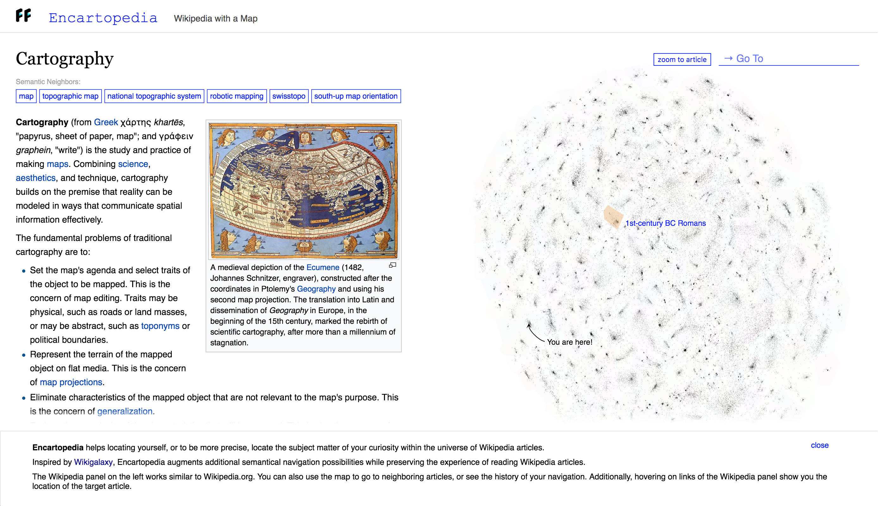
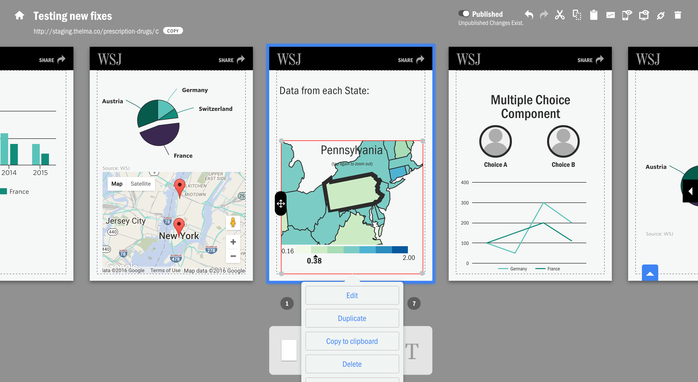
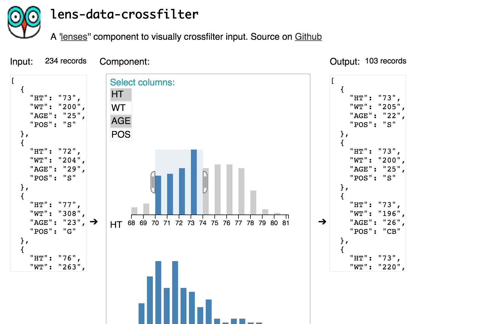
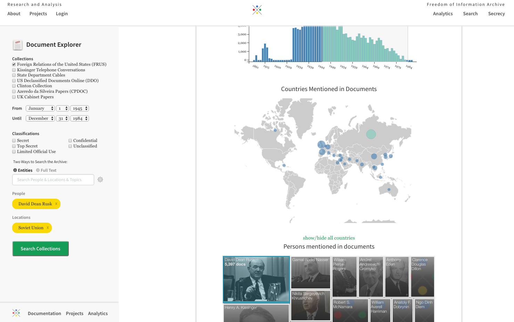
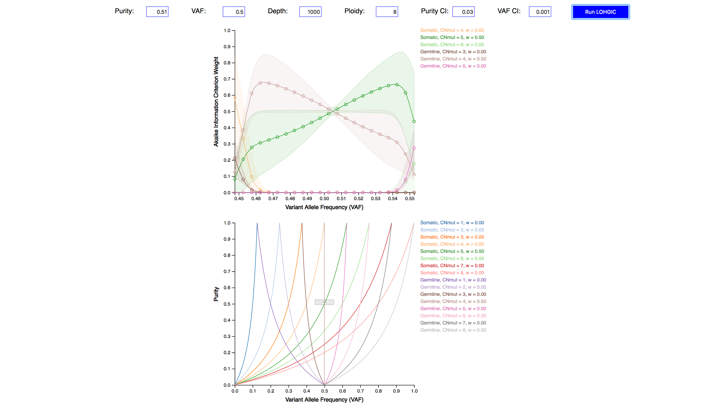

	<h2>Encartopedia</h2>
	
	

		Encartopedia helps locating yourself, or to be more precise, locate the subject matter of your curiosity within the universe of Wikipedia articles.
		Encartopedia augments additional semantical navigation possibilities while preserving the experience of reading Wikipedia articles.
		The Wikipedia panel on the left works similar to Wikipedia.org. You can also use the map to go to neighboring articles, or see the history of your navigation. Additionally, hovering on links of the Wikipedia panel show you the location of the target article. <a href="http://encartopedia.fastforwardlabs.com/" class="link" target="_blank">Link</a>
	

	<h2>Thelma</h2>
	
	

		Thelma is a data visualization based mobile story-telling content management tool developed for WSJ along with Big Human. Journalists are able to use more than 50 custom made visualization components to create interactive and engaging stories.
	

	<h2>Lenses</h2>
	
	

		Lenses is a framework of open-source data visualization and data transformation Polymer web components for fetching, manipulating and visualizing data. Using drag and drop components users can load raw data from an API or files, apply mathematical and statistical operations on it and then visualize and publish the result without requiring any coding. <a href="http://lenses.github.io/lenses-freeform/" class="link" target="_blank">Link</a>
	

	<h2>History lab</h2>
	
	

		History Lab is a project by Department of History at Columbia University to apply Machine learning and Natural language
		processing over a large corpus of declassified documents. For this project we created a visual search system, among other things, to enable users to use the visualization of the occurrence of concepts in the documents to refine search queries. <a href="http://history-lab.org/" class="link" target="_blank">Link</a>
	

	<h2>LOH-Germline Inference Calculator (LOHGIC)</h2>
	

	

		Port of the algorithm based on Khiabanian et al. 2017, Rutgers Cancer Institute, Center for Systems and Computational Biology from Matlab to Javascript and d3.js to make it accessible to other cancer researchers to determine mutational status of variants identified in patient's sequenced DNA. <a href="http://www.khiabanian-lab.org/pages/lohgic.html" class="link" target="_blank">Link</a>
	

